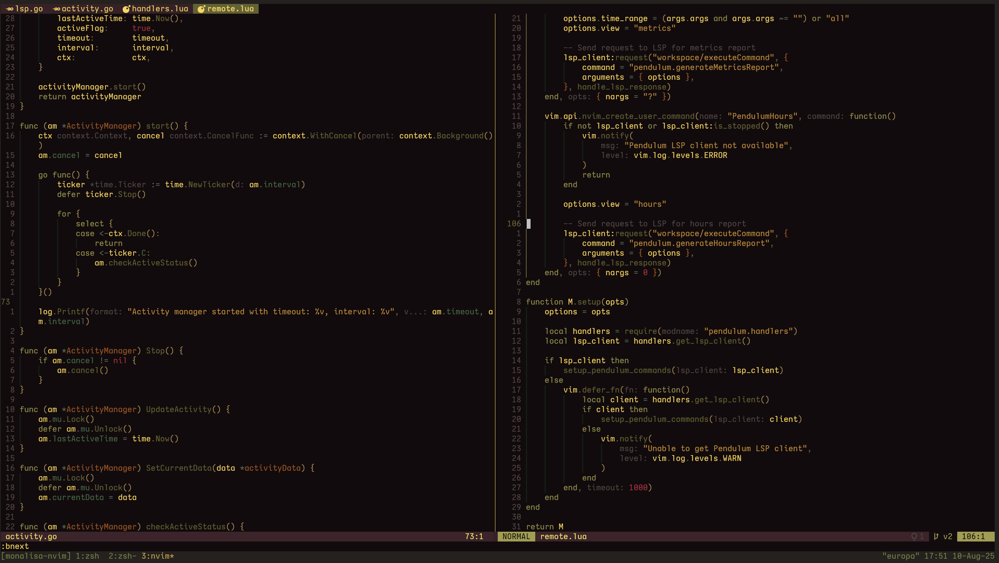

<h1 align="center">MonaLisa</h1>

<p align="center">A dark and colorful theme for Neovim</p>



Inspired by the painting and the iterm2 theme.

> [!NOTE]
> This theme is still a work in progress, and colors may change in the near future.

Built with [lush](https://github.com/rktjmp/lush.nvim).

## Installation

Lazy.nvim:
```lua
{
    "ptdewey/monalisa-nvim",
    priority = 1000,
}
```

## Usage

```lua
vim.cmd.colorscheme("monalisa")
```

## Build or Modify

1. Ensure [lush.nvim](https://github.com/rktjmp/lush.nvim) and [shipwright.nvim](https://github.com/rktjmp/shipwright.nvim) are installed
2. Modify [lush_theme/monalisa.lua](lush_theme/monalisa.lua)
3. Rebuild the colorscheme using `./build.sh`
